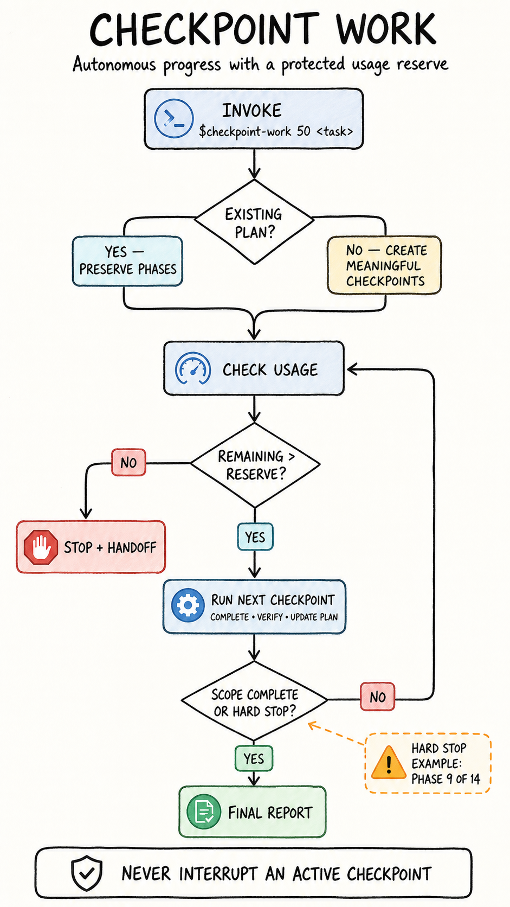

# Checkpoint Work

**Autonomous checkpoint-based work with protected usage reserves for Codex and Claude Code.**

[](https://github.com/mbernahr/checkpoint-work/actions/workflows/test.yml)
[](https://www.python.org/)
[](LICENSE)
[](#platform-support)



Checkpoint Work lets an AI coding agent continue through long tasks without waiting for repeated “continue” prompts. It divides unstructured work into meaningful checkpoints, respects existing project phases, verifies each completed unit, and stops before starting another checkpoint when a configurable usage reserve is reached.

**No API key is required. Usage is read locally from the active Codex or Claude Code session.**

[How it works](#how-it-works) · [Installation](#installation) · [Usage](#usage) · [Safety](#safety-and-privacy) · [Development](#development)

## Highlights

- Runs consecutive checkpoints autonomously.
- Preserves a user-selected percentage of remaining usage.
- Always completes and verifies an active checkpoint before stopping.
- Reuses existing phases, milestones, numbering, and ordering.
- Supports hard stops such as “stop after Phase 9 of 14.”
- Creates meaningful checkpoints automatically when no plan exists.
- Produces a concise, resumable handoff when work stops early.
- Fails safely when current usage cannot be measured.

## How it works

Invoke the skill with a reserve percentage and a task. Before every new checkpoint, it reads the most constrained active usage window.

```text
usage remaining > reserve  →  start and finish the next checkpoint
usage remaining ≤ reserve  →  stop and provide a resumable handoff
requested scope complete   →  stop normally
hard-stop phase complete   →  stop without starting the next phase
```

The reserve is checked only at checkpoint boundaries. If usage falls below the reserve while a checkpoint is active, that checkpoint is still completed and verified. This avoids leaving edits, migrations, or tests half-finished.

### Example

With a `10%` reserve:

- At `11%` remaining, the next checkpoint may start.
- The active checkpoint finishes even if usage drops below `10%`.
- At `10%` or less, no additional checkpoint starts.

## Platform support

| | Codex | Claude Code |
| --- | --- | --- |
| Invocation | `$checkpoint-work 10 …` | `/checkpoint-work 10 …` |
| Skill format | `SKILL.md` | `SKILL.md` |
| Usage source | Local Codex app server | Status-line `rate_limits` data |
| Measured windows | Active Codex rate-limit windows | 5-hour and 7-day windows |
| API key required | No | No |

Claude.ai web chat is not supported by the local usage checker.

## Requirements

- Python 3.10 or newer
- Git
- One supported host:
  - Codex desktop or CLI authenticated with a ChatGPT account
  - Claude Code with rate-limit data available to its status line

## Installation

### Codex

Install the repository as a personal Codex skill:

```bash
mkdir -p ~/.codex/skills
git clone https://github.com/mbernahr/checkpoint-work.git ~/.codex/skills/checkpoint-work
```

Restart Codex if the skill does not appear immediately.

Verify the local usage adapter:

```bash
python3 ~/.codex/skills/checkpoint-work/scripts/check_usage.py \
  --provider codex \
  --reserve 10
```

### Claude Code

Install the repository as a personal Claude Code skill:

```bash
mkdir -p ~/.claude/skills
git clone https://github.com/mbernahr/checkpoint-work.git ~/.claude/skills/checkpoint-work
```

Configure the local usage capture:

```bash
python3 ~/.claude/skills/checkpoint-work/scripts/setup_claude_statusline.py
```

Restart Claude Code and send one message so its official 5-hour and 7-day rate-limit fields can populate the local cache. Then verify the adapter:

```bash
python3 ~/.claude/skills/checkpoint-work/scripts/check_usage.py \
  --provider claude \
  --reserve 10
```

The setup helper preserves unrelated Claude settings, creates a timestamped backup of an existing settings file, and refuses to replace an existing custom status line.

<details>
<summary><strong>Install once for both Codex and Claude Code</strong></summary>

Clone the repository into a permanent location and link it into both skill directories:

```bash
git clone https://github.com/mbernahr/checkpoint-work.git checkpoint-work
mkdir -p ~/.codex/skills ~/.claude/skills
ln -s "$(pwd)/checkpoint-work" ~/.codex/skills/checkpoint-work
ln -s "$(pwd)/checkpoint-work" ~/.claude/skills/checkpoint-work
python3 checkpoint-work/scripts/setup_claude_statusline.py
```

On Windows, copy the repository into both skill directories instead of creating symbolic links.

</details>

## Usage

The number after the skill name is the percentage of usage to keep in reserve.

### Codex

```text
$checkpoint-work 10 Finish the remaining implementation, tests, and documentation.
```

### Claude Code

```text
/checkpoint-work 10 Finish the remaining implementation, tests, and documentation.
```

### Stop after a specific phase

```text
$checkpoint-work 50 Complete all unfinished work through Phase 9 of 14.
Phase 9 is a hard stop. Do not begin Phase 10.
```

Claude Code uses the same task with `/checkpoint-work`.

The run ends when the first of these conditions is met:

1. Phase 9 is complete.
2. Remaining usage is `50%` or lower at the next checkpoint boundary.

### Work without a predefined plan

```text
$checkpoint-work 20 Build and verify the requested feature end to end.
```

When no authoritative structure exists, the skill creates coherent checkpoints automatically. When a project already defines phases or tasks, that structure is preserved.

## Usage decisions

The checker emits machine-readable JSON so the agent can make a deterministic decision:

```json
{
  "ok": true,
  "provider": "claude",
  "remaining_percent": 18,
  "limiting_window": "seven_day",
  "reserve_percent": 10,
  "may_start_next_checkpoint": true
}
```

When multiple rate-limit windows are present, the window with the least remaining usage controls the decision.

## Safety and privacy

Checkpoint Work is deliberately fail-closed: if it cannot obtain a current usage value, it does not estimate one and does not begin another checkpoint.

- The Codex adapter starts a local `codex app-server` process and reads the signed-in account's rate-limit snapshot.
- The Claude adapter receives status-line JSON and stores only rate-limit percentages, reset timestamps, and a local capture timestamp.
- Authentication tokens, prompts, source files, and conversation content are not stored.
- Invoking the skill does not authorize unrelated edits, destructive operations, purchases, publication, or bypassing normal approvals.

## Troubleshooting

<details>
<summary><strong>Codex usage cannot be read</strong></summary>

Confirm that Codex is installed and authenticated, then inspect `/status`. To select a non-standard executable:

```bash
CHECKPOINT_WORK_CODEX_BIN=/path/to/codex \
  ./scripts/check_usage.py --provider codex --reserve 10
```

The Codex `account/rateLimits/read` method is experimental and may change in a future Codex release.

</details>

<details>
<summary><strong>Claude usage cache is missing or stale</strong></summary>

Restart Claude Code, send one message, and inspect `/usage`. The checker rejects cache snapshots older than 15 minutes by default.

```bash
./scripts/check_usage.py \
  --provider claude \
  --reserve 10 \
  --max-cache-age 900
```

Claude rate-limit fields may be unavailable before the first response or for authentication plans that do not expose them.

</details>

<details>
<summary><strong>Claude Code already has a custom status line</strong></summary>

Claude Code supports one `statusLine.command`, so the setup helper will not overwrite an existing configuration. Integrate manually by making the existing status-line script read stdin once, pass the same JSON to `scripts/capture_claude_usage.py` with its output hidden, and then render the existing status text from that JSON.

</details>

## Project structure

```text
checkpoint-work/
├── SKILL.md                         # Shared agent workflow
├── agents/openai.yaml               # Codex UI metadata
├── assets/                          # README graphics
├── scripts/
│   ├── check_usage.py               # Provider-independent decision CLI
│   ├── capture_claude_usage.py      # Claude status-line capture
│   └── setup_claude_statusline.py   # Safe Claude setup helper
├── tests/                            # Deterministic unit tests
└── .github/workflows/test.yml        # Linux, macOS, and Windows CI
```

## Development

Run the test suite without contacting Codex or Claude:

```bash
python3 -m unittest discover -s tests -v
```

The GitHub Actions workflow tests Python 3.10 and 3.13 on Linux, macOS, and Windows.

## Contributing

Issues and pull requests are welcome. For compatibility reports, include:

- Codex or Claude Code version
- operating system
- authentication type or plan, without account details
- sanitized checker output
- steps needed to reproduce the problem

Please do not include credentials, authentication tokens, private prompts, or proprietary source code.

## License

Released under the [MIT License](LICENSE).
