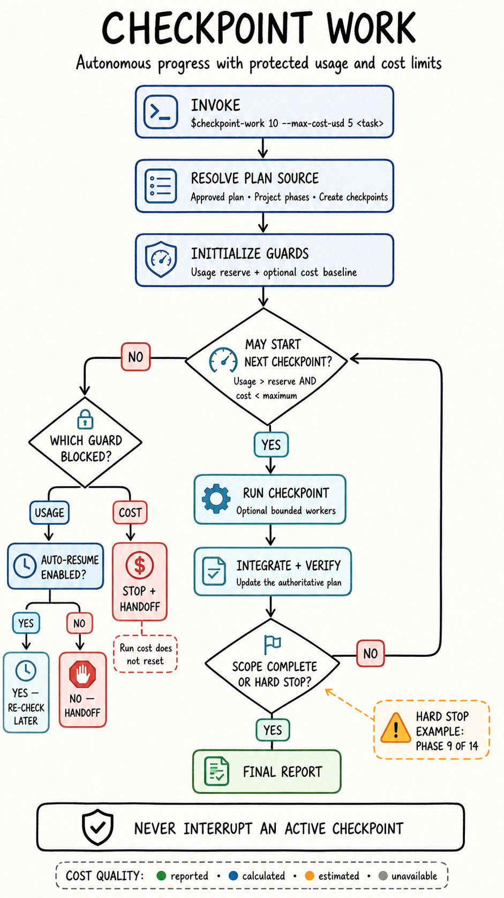

# Checkpoint Work

**Autonomous checkpoint-based work with protected usage reserves and optional run-cost limits for Codex and Claude Code.**

[](https://github.com/mbernahr/checkpoint-work/actions/workflows/test.yml)
[](https://www.python.org/)
[](LICENSE)
[](#platform-support)



_A checkpoint starts only when the requested scope, the usage reserve, and the optional cost guard all allow it._

Checkpoint Work lets an AI coding agent continue through long tasks without waiting for repeated “continue” prompts. It divides unstructured work into meaningful checkpoints, respects existing project phases, verifies each completed unit, and stops before starting another checkpoint when a configurable usage reserve or optional USD run-cost limit is reached.

**No API key is required for the built-in Codex and Claude Code adapters. Usage and available cost estimates are read locally from the active session.**

[Quick start](#quick-start) · [Execution model](#how-it-works) · [Installation](#installation) · [Command reference](#command-reference) · [Examples](#examples) · [Safety](#safety-and-privacy)

## Capabilities

| Capability | Behavior |
| --- | --- |
| Configurable reserve | Preserves a user-selected percentage of remaining account usage. |
| Optional cost guard | Prevents another checkpoint from starting once the measured run cost reaches `--max-cost-usd`. |
| Plan-aware execution | Reuses the approved host plan, an explicitly named plan file, or project phases and tickets. |
| Automatic planning | Creates meaningful checkpoints when no authoritative plan exists. |
| Atomic checkpoints | Completes, integrates, and verifies active work before stopping. |
| Hard scope boundaries | Stops at an explicitly named phase or task even when usage remains. |
| Optional auto-resume | Schedules one host-supported re-check after a limiting window resets. |
| Bounded parallelism | Allows a controlled worker wave inside a checkpoint. |
| Resumable handoff | Records the plan, completed work, verification state, usage window, and exact next action. |
| Fail-closed measurement | Never invents a percentage or starts more work without a current measurement. |

## Quick start

After [installing the skill](#installation), invoke it with the percentage of account usage to preserve and the work to complete:

```text
$checkpoint-work 10 Complete the approved implementation plan through Phase 8.
```

In Claude Code, use the slash form:

```text
/checkpoint-work 10 Complete the approved implementation plan through Phase 8.
```

The agent continues checkpoint by checkpoint until the requested scope is complete, a hard stop is reached, approval is required, or remaining usage reaches the protected reserve.

### When to use it

Checkpoint Work is designed for multi-step implementation, refactoring, migration, testing, documentation, and research work that should continue without repeated “continue” prompts. For a small one-shot edit, a usage check and checkpoint plan usually add unnecessary ceremony.

## How it works

Invoke the skill with a reserve percentage and a task. Before every new checkpoint, it reads the most constrained active usage window.

### Execution lifecycle

1. Resolve the requested scope and any hard stop.
2. Select the authoritative plan source, or create meaningful checkpoints when none exists.
3. Measure the most constrained available usage window and, when requested, the run cost.
4. Start one checkpoint only when remaining usage is above the reserve and run cost is below its limit.
5. Finish, integrate, and verify the entire active checkpoint.
6. Update the authoritative plan and measure usage again.
7. Continue, stop with a handoff, or arrange an opt-in automatic resume.

```text
usage remaining > reserve  →  start and finish the next checkpoint
usage remaining ≤ reserve  →  stop and provide a resumable handoff
run cost < maximum cost     →  cost guard allows the next checkpoint
run cost ≥ maximum cost     →  stop; accumulated run cost does not reset
requested scope complete   →  stop normally
hard-stop phase complete   →  stop without starting the next phase
```

The reserve is checked only at checkpoint boundaries. If usage falls below the reserve while a checkpoint is active, that checkpoint is still completed and verified. This avoids leaving edits, migrations, or tests half-finished.

### Plan selection

Checkpoint Work uses the first applicable source instead of maintaining a competing checklist:

| Priority | Plan source |
| --- | --- |
| 1 | The user's explicit scope, order, and hard stop |
| 2 | The plan approved in the current host session or a plan file explicitly named by the user |
| 3 | Project phases, milestones, specifications, or implementation tickets |
| 4 | Newly created coherent checkpoints |

It never selects a global plan merely because that file is the newest one.

### Stopping behavior

| Condition at a checkpoint boundary | Result |
| --- | --- |
| Requested scope is complete | Stop normally and report verification. |
| Explicit hard-stop phase is complete | Stop without starting the next phase. |
| Remaining usage is above the reserve | Start the next checkpoint. |
| Remaining usage equals or falls below the reserve | Stop and create a handoff. |
| Current usage cannot be measured | Fail closed and do not start more work. |
| Measured run cost reaches the optional maximum | Stop and create a handoff; do not auto-resume. |
| Comparable run cost cannot be measured while a cost limit is active | Fail closed and do not start more work. |
| Approval or a user decision is required | Preserve state and ask for the missing decision. |

### Example

With a `10%` reserve:

- At `11%` remaining, the next checkpoint may start.
- The active checkpoint finishes even if usage drops below `10%`.
- At `10%` or less, no additional checkpoint starts.

Unlike a simple usage guard, Checkpoint Work also decides which approved work unit comes next, what must be verified before that unit is complete, and where the requested scope ends. Usage protection is part of the execution protocol rather than a standalone alarm.

## Platform support

| | Codex | Claude Code |
| --- | --- | --- |
| Invocation | `$checkpoint-work 10 …` | `/checkpoint-work 10 …` |
| Skill format | `SKILL.md` | `SKILL.md` |
| Usage source | Local Codex app server | Status-line `rate_limits` data |
| Built-in cost source | App-server estimated thread usage, when available | Status-line estimated session cost |
| Measured windows | Active Codex rate-limit windows | 5-hour and 7-day windows |
| Existing plans | Active host plan or project plan | Approved Plan Mode file or project plan |
| API key required | No | No |

Claude.ai web chat is not supported by the local usage checker.

## Requirements

- Python 3.10 or newer
- Git
- One supported host:
  - Codex desktop or CLI authenticated with a ChatGPT account
  - Claude Code with rate-limit data available to its status line

## Installation

### Codex

Install the repository as a personal Codex skill:

```bash
mkdir -p ~/.codex/skills
git clone https://github.com/mbernahr/checkpoint-work.git ~/.codex/skills/checkpoint-work
```

Restart Codex if the skill does not appear immediately.

Verify the local usage adapter:

```bash
python3 ~/.codex/skills/checkpoint-work/scripts/check_usage.py \
  --provider codex \
  --reserve 10
```

### Claude Code

Install the repository as a personal Claude Code skill:

```bash
mkdir -p ~/.claude/skills
git clone https://github.com/mbernahr/checkpoint-work.git ~/.claude/skills/checkpoint-work
```

Configure the local usage capture:

```bash
python3 ~/.claude/skills/checkpoint-work/scripts/setup_claude_statusline.py
```

Restart Claude Code and send one message so its official 5-hour and 7-day rate-limit fields can populate the local cache. Then verify the adapter:

```bash
python3 ~/.claude/skills/checkpoint-work/scripts/check_usage.py \
  --provider claude \
  --reserve 10
```

The setup helper preserves unrelated Claude settings, creates a timestamped backup of an existing settings file, and refuses to replace an existing custom status line.

#### Why Claude uses a helper script

[Claude Code already sends](https://code.claude.com/docs/en/statusline) the official `rate_limits` fields and `cost.total_cost_usd` to its status-line command. The small capture helper stores that transient usage snapshot and estimated session cost so Checkpoint Work can read them at the next checkpoint boundary. Claude documents the cost as a client-side estimate that may differ from the actual bill. The helper does not install a usage package, call a third-party service, or use an API key, and the normal status-line display may still render icons and context information.

If a custom status line is already configured, keep it. The installer refuses to overwrite it; follow the [manual integration note](#troubleshooting) to pass the same input through the capture helper.

<details>
<summary><strong>Install once for both Codex and Claude Code</strong></summary>

Clone the repository into a permanent location and link it into both skill directories:

```bash
git clone https://github.com/mbernahr/checkpoint-work.git checkpoint-work
mkdir -p ~/.codex/skills ~/.claude/skills
ln -s "$(pwd)/checkpoint-work" ~/.codex/skills/checkpoint-work
ln -s "$(pwd)/checkpoint-work" ~/.claude/skills/checkpoint-work
python3 checkpoint-work/scripts/setup_claude_statusline.py
```

On Windows, copy the repository into both skill directories instead of creating symbolic links.

</details>

## Command reference

The number after the skill name is the percentage of usage to keep in reserve.

```text
$checkpoint-work <reserve-percent> [--max-cost-usd AMOUNT] [--auto-resume] [--max-parallel N] <task>
/checkpoint-work <reserve-percent> [--max-cost-usd AMOUNT] [--auto-resume] [--max-parallel N] <task>
```

| Argument | Required | Meaning |
| --- | --- | --- |
| `<reserve-percent>` | Yes | Remaining account usage to preserve, from `0` to `100`. |
| `<task>` | Yes | Work scope, completion criteria, and optional hard stop. |
| `--max-cost-usd AMOUNT` | No | Adds a non-negative soft USD checkpoint-start limit for this run. |
| `--auto-resume` | No | Authorizes one host-supported wakeup and a mandatory fresh usage check. |
| `--max-parallel N` | No | Sets a positive limit for simultaneous workers inside one checkpoint. |

Without `--max-parallel`, the skill uses at most 2 workers and may remain fully sequential when work is coupled.

## Examples

### Codex

```text
$checkpoint-work 10 Finish the remaining implementation, tests, and documentation.
```

### Claude Code

```text
/checkpoint-work 10 Finish the remaining implementation, tests, and documentation.
```

### Optional automatic resume

Add `--auto-resume` when the host should arrange a later re-check after the limiting usage window resets:

```text
$checkpoint-work 10 --auto-resume Complete the approved implementation plan.
```

Auto-resume is deliberately opt-in. It schedules at most one host-supported wakeup for the current run. The wakeup carries a self-contained handoff and checks the real account usage again before starting work; elapsed time or a passed reset timestamp is never treated as proof that capacity is available. If the host cannot schedule a suitable resume, the skill falls back to a manual resume prompt.

Auto-resume applies to a limiting usage window, not to a reached monetary limit. Accumulated run cost does not reset automatically.

### Optional run-cost limit

Add an independent USD guard alongside the usage reserve:

```text
$checkpoint-work 10 --max-cost-usd 5 Complete the approved plan.
```

This means: preserve `10%` remaining usage and do not start another checkpoint once this invocation has accumulated `$5.00` of measurable cost. Both conditions must allow the next start. An active checkpoint is still completed and may therefore overshoot the limit.

The checker creates a baseline on the first boundary and keeps it under an opaque run ID across later checks and handoffs. It never silently mixes measurement categories:

| `cost_quality` | Meaning |
| --- | --- |
| `reported` | Provider-reported monetary amount |
| `calculated` | Calculated from measured usage and a declared pricing version |
| `estimated` | Provider or adapter estimate, including an API-equivalent value |
| `unavailable` | No reliable comparable value; the next checkpoint is denied |

Codex uses local estimated thread cost when the current billing route exposes `estimatedUsageUsdMicros`. Claude Code uses its documented client-side estimated session cost. An external host may supply a cumulative value with an explicit quality, source, scope, and identity. OpenAI also exposes an authenticated [organization costs endpoint](https://developers.openai.com/api/reference/python/resources/admin/subresources/organization/subresources/usage), but organization-wide spend is not automatically attributable to one Checkpoint Work invocation and is therefore not used by the built-in local adapter.

#### Cost-source availability

| Source | Availability | Quality | Scope | Notes |
| --- | --- | --- | --- | --- |
| Codex local app server | When the active billing route exposes `estimatedUsageUsdMicros` | `estimated` | Thread | Some ChatGPT subscription routes do not expose a comparable USD value; the guard then fails closed. |
| Claude Code status line | When `cost.total_cost_usd` is present | `estimated` | Session | Client-side estimate; it may differ from the final bill and resets with a new session. |
| External cumulative adapter | When the host supplies value, quality, source, scope, and identity | Declared explicitly | Adapter-defined | Suitable for provider-reported or independently calculated values; inconsistent metadata fails closed. |

Cost qualities are never silently converted or combined. `reported`, `calculated`, and `estimated` describe different evidence; `unavailable` means another checkpoint cannot start while the cost guard is active.

### Optional bounded parallelism

Parallel workers may be used inside one checkpoint when their scopes are independent:

```text
/checkpoint-work 20 --max-parallel 3 Complete the approved migration plan.
```

Without this option, the maximum is 2 simultaneous workers, and the agent may choose fewer or remain sequential. A checkpoint launches at most one worker wave, waits for all in-flight work, integrates the results, and verifies the complete checkpoint before checking usage again.

### Stop after a specific phase

```text
$checkpoint-work 50 Complete all unfinished work through Phase 9 of 14.
Phase 9 is a hard stop. Do not begin Phase 10.
```

Claude Code uses the same task with `/checkpoint-work`.

The run ends when the first of these conditions is met:

1. Phase 9 is complete.
2. Remaining usage is `50%` or lower at the next checkpoint boundary.

### Work without a predefined plan

```text
$checkpoint-work 20 Build and verify the requested feature end to end.
```

When no authoritative structure exists, the skill creates coherent checkpoints automatically. When a project already defines phases or tasks, that structure is preserved.

### Work from an approved plan

Checkpoint Work does not need to invent another plan. It uses the first authoritative source available: the user's hard stop, the plan approved in the current Codex or Claude session, an explicitly named plan file, or the project's own phases and implementation tickets.

```text
/checkpoint-work 20 Execute the approved plan through task 6.
Task 6 is a hard stop.
```

In Claude Code, [Plan Mode remains read-only](https://code.claude.com/docs/en/permission-modes). Checkpoint Work can help structure the plan there, but implementation starts only after the plan is approved and Claude Code returns to an execution-capable mode. Claude's [`plansDirectory` setting](https://code.claude.com/docs/en/configuration) defaults to `~/.claude/plans` and can point to a project-relative directory. The skill uses the current session's approved plan or a path you explicitly name; it does not guess by selecting the newest global plan.

[Wayfinder-style maps](https://github.com/mattpocock/skills/blob/main/skills/engineering/wayfinder/SKILL.md) are supported as an upstream planning source. Unresolved decision or research tickets remain planning work. Once the map produces an approved specification or executable build tickets, those artifacts become Checkpoint Work's checkpoints.

## Usage decisions

The checker emits machine-readable JSON so the agent can make a deterministic decision:

```json
{
  "ok": true,
  "provider": "claude",
  "remaining_percent": 18,
  "limiting_window": "seven_day",
  "limiting_resets_at": 1787755644,
  "limiting_window_id": "claude:seven_day:1787755644",
  "reserve_percent": 10,
  "run_cost_usd": 4.87,
  "max_cost_usd": 5,
  "cost_quality": "estimated",
  "cost_source": "claude_statusline",
  "cost_scope": "session",
  "cost_limit_allows_start": true,
  "may_start_next_checkpoint": true
}
```

When multiple rate-limit windows are present, the window with the least remaining usage controls the decision.

## Handoff and resume

When work stops before the requested scope is complete, the handoff records:

- the provider, remaining usage, protected reserve, limiting window, reset time, and window identity;
- run cost, maximum cost, quality, source, scope, and cost run ID when cost control is active;
- the authoritative plan source and its current state;
- completed checkpoints, changed files, and verification results;
- remaining checkpoints and the exact next action;
- a self-contained `$checkpoint-work` or `/checkpoint-work` resume prompt.

Every manual or automatic resume measures the real account window again. A reset timestamp or elapsed delay alone never authorizes more work. Auto-resume remains limited to the original task and falls back to a manual handoff when the host cannot schedule a suitable wakeup.

## Current scope and limitations

- Monetary control is a soft checkpoint-start limit, not a guaranteed billing cap; an active checkpoint may overshoot it.
- Built-in Codex and Claude monetary values are estimates and must not be described as billed amounts.
- If the current provider or billing route supplies no comparable USD value, cost control fails closed.
- Auto-resume depends on a compatible host wake or scheduling facility.
- Usage is checked at coherent checkpoint boundaries, so a checkpoint may finish after the reserve has been crossed.
- Claude.ai web chat is not supported by the local checker.
- Provider fields may change; unavailable or stale measurements always fail closed.

## Safety and privacy

Checkpoint Work is deliberately fail-closed: if it cannot obtain a current usage value, it does not estimate one and does not begin another checkpoint.

- The Codex adapter starts a local `codex app-server` process and reads the signed-in account's rate-limit snapshot.
- The Claude adapter stores only rate-limit percentages, reset timestamps, estimated session cost, session identity, and a local capture timestamp from status-line JSON.
- When cost control is used, the local run-state file stores only the cumulative-cost baseline and source metadata under `~/.checkpoint-work/cost-runs/`.
- Authentication tokens, prompts, source files, and conversation content are not stored.
- Invoking the skill does not authorize unrelated edits, destructive operations, purchases, publication, or bypassing normal approvals.
- Scheduled wakeups are created only when `--auto-resume` is explicitly requested and remain limited to the original task.

## Troubleshooting

<details>
<summary><strong>Codex usage cannot be read</strong></summary>

Confirm that Codex is installed and authenticated, then inspect `/status`. To select a non-standard executable:

```bash
CHECKPOINT_WORK_CODEX_BIN=/path/to/codex \
  ./scripts/check_usage.py --provider codex --reserve 10
```

The Codex `account/rateLimits/read` method is experimental and may change in a future Codex release.

The executable is discovered through `PATH` on Linux, macOS, and Windows. `/Applications/Codex.app/Contents/Resources/codex` is used only as a macOS fallback; it is not required on other platforms. The app-server reader uses a portable background pipe reader rather than Unix-only pipe selectors.

</details>

<details>
<summary><strong>Claude usage cache is missing or stale</strong></summary>

Restart Claude Code, send one message, and inspect `/usage`. The checker rejects cache snapshots older than 15 minutes by default.

```bash
./scripts/check_usage.py \
  --provider claude \
  --reserve 10 \
  --max-cache-age 900
```

Claude rate-limit fields may be unavailable before the first response or for authentication plans that do not expose them.

</details>

<details>
<summary><strong>Claude Code already has a custom status line</strong></summary>

Claude Code supports one `statusLine.command`, so the setup helper will not overwrite an existing configuration. Integrate manually by making the existing status-line script read stdin once, pass the same JSON to `scripts/capture_claude_usage.py` with its output hidden, and then render the existing status text from that JSON.

</details>

## Project structure

```text
checkpoint-work/
├── SKILL.md                         # Shared agent workflow
├── agents/openai.yaml               # Codex UI metadata
├── assets/                          # README graphics
├── references/
│   ├── plan-sources.md              # Codex, Claude, and Wayfinder plan precedence
│   ├── cost-control.md              # Cost sources, quality, baseline, and fail-closed rules
│   └── resume-and-parallel.md       # Optional wakeups and bounded concurrency
├── scripts/
│   ├── check_usage.py               # Provider-independent decision CLI
│   ├── capture_claude_usage.py      # Claude status-line capture
│   └── setup_claude_statusline.py   # Safe Claude setup helper
├── tests/                            # Deterministic unit tests
└── .github/workflows/test.yml        # Linux, macOS, and Windows CI
```

## Development

Run the test suite without contacting Codex or Claude:

```bash
python3 -m unittest discover -s tests -v
```

The GitHub Actions workflow tests Python 3.10 and 3.13 on Linux, macOS, and Windows.

## Contributing

Issues and pull requests are welcome. For compatibility reports, include:

- Codex or Claude Code version
- operating system
- authentication type or plan, without account details
- sanitized checker output
- steps needed to reproduce the problem

Please do not include credentials, authentication tokens, private prompts, or proprietary source code.

## License

Released under the [MIT License](LICENSE).
